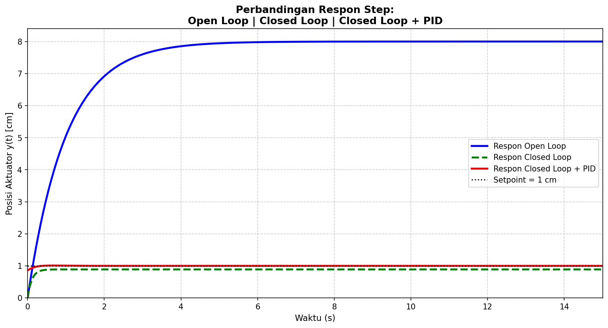

# 🎛️ Simulasi Sistem Kendali Linear – UAS Genap 2025/2026

Simulasi dan analisis sistem kendali untuk **linear aktuator** menggunakan Python.  
Mencakup analisis open loop, closed loop, dan kendali PID dengan metode Ziegler-Nichols.

---

## 📋 Deskripsi

Program ini dibuat sebagai tugas Ujian Akhir Semester mata kuliah **Sistem Kendali**  
di Program Studi Teknik Otomasi Manufaktur & Mekatronika – Polman Bandung.

Sistem yang dimodelkan adalah linear aktuator dengan persamaan gerak:

```
y(t) = A(1 - e^(-Bt))
```

Diasumsikan sebagai sistem orde-1 dengan fungsi transfer:

```
          K
G(s) = ───────    dengan K = 8, τ = 1.0 s
        τs + 1
```

---

## 🗂️ Struktur File

```
📁 repo/
├── 225443008_Farhan_Maulana_UAS_Kendali.py   # Source code utama
├── README.md                                  # Dokumentasi ini
└── output/                                    # (di-generate saat run)
    ├── plot1_openloop.png                     # Respon step open loop
    ├── plot2_splane.png                       # Peta pole (s-plane)
    ├── plot3_ol_vs_cl.png                     # Open loop vs closed loop
    ├── plot4_all.png                          # Perbandingan 3 sistem
    └── plot5_metrics.png                      # Bar chart performa
```

---

## ⚙️ Requirements

Python 3.8 atau lebih baru, dengan library berikut:

| Library | Versi | Fungsi |
|---|---|---|
| `numpy` | ≥ 1.21 | Komputasi numerik dan array |
| `matplotlib` | ≥ 3.4 | Visualisasi grafik |
| `control` | ≥ 0.9 | Pemodelan dan simulasi sistem kendali |

Install sekaligus:

```bash
pip install numpy matplotlib control
```

---

## 🚀 Cara Menjalankan

```bash
python 225443008_Farhan_Maulana_UAS_Kendali.py
```

Program akan mencetak hasil analisis di terminal dan menyimpan **5 file grafik PNG**  
di direktori yang sama.

---

## 📊 Hasil Simulasi

### Perbandingan Performa Tiga Sistem

| Karakteristik | Open Loop | Closed Loop | PID |
|---|:---:|:---:|:---:|
| Rise Time (s) | 2.1911 | 0.2476 | **0.0600** |
| Settling Time (s) | 3.9095 | 0.4277 | **0.2476** |
| Overshoot (%) | 0.00 | 0.00 | 1.11 |
| Peak Time (s) | 15.000 | 3.8344 | 0.6453 |
| Steady-State Value | 8.0000 | 0.8889 | **1.0000** |

### Grafik Perbandingan

> Jalankan program untuk menghasilkan grafik. Contoh output `plot4_all.png`:



---

## 🔍 Cakupan Analisis

**Soal 1 – Parameter Sistem**
- Penentuan A, B, K, dan τ dari data NIM dan nomor absen
- Model fungsi transfer G(s) dan blok diagram

**Soal 2 – Open Loop**
- Pemodelan dengan `control.tf()`
- Simulasi step response
- Analisis pole, steady-state, dan time constant
- Peta pole pada bidang-s (s-plane)

**Soal 3 – Closed Loop**
- Unity feedback dengan `control.feedback()`
- Derivasi manual T(s) = G(s) / (1 + G(s)) = 8 / (s + 9)
- Perbandingan rise time, settling time, dan steady-state

**Soal 4 – Penalaan PID Ziegler-Nichols**
- Ku = 10, Pu = 1.0 s
- Kp = 6.0 | Ti = 0.5 s | Td = 0.125 s
- Ki = 12.0 | Kd = 0.75
- Fungsi transfer C(s) = (0.75s² + 6s + 12) / s

**Soal 5 – Simulasi PID**
- T_pid(s) = (6s² + 48s + 96) / (7s² + 49s + 96)
- Grafik gabungan 3 sistem dalam satu figure
- Tabel perbandingan lengkap

**Soal 6 – Analisis Hasil**
- Pengaruh feedback, PID, overshoot, dan error steady-state

---

## 🧰 Penjelasan Library

**NumPy** — digunakan untuk membuat array waktu (`linspace`), operasi matematika vektor, dan pencarian indeks (`where`, `argmax`).

**Matplotlib** — digunakan untuk membuat semua grafik: step response, s-plane pole-zero map, dan bar chart perbandingan performa.

**control (Python Control Systems Library)** — digunakan untuk:
- `control.tf()` — membuat objek fungsi transfer
- `control.feedback()` — menghitung closed-loop dari feedback unity
- `control.step_response()` — mensimulasikan respons terhadap input step
- `control.poles()` — mendapatkan nilai pole sistem

---

## 📌 Informasi

- **Mata Kuliah**: Sistem Kendali
- **Program Studi**: Teknik Otomasi Manufaktur & Mekatronika
- **Institusi**: Politeknik Manufaktur Bandung (Polman)
- **Tahun Ajaran**: 2025/2026 (Semester Genap)